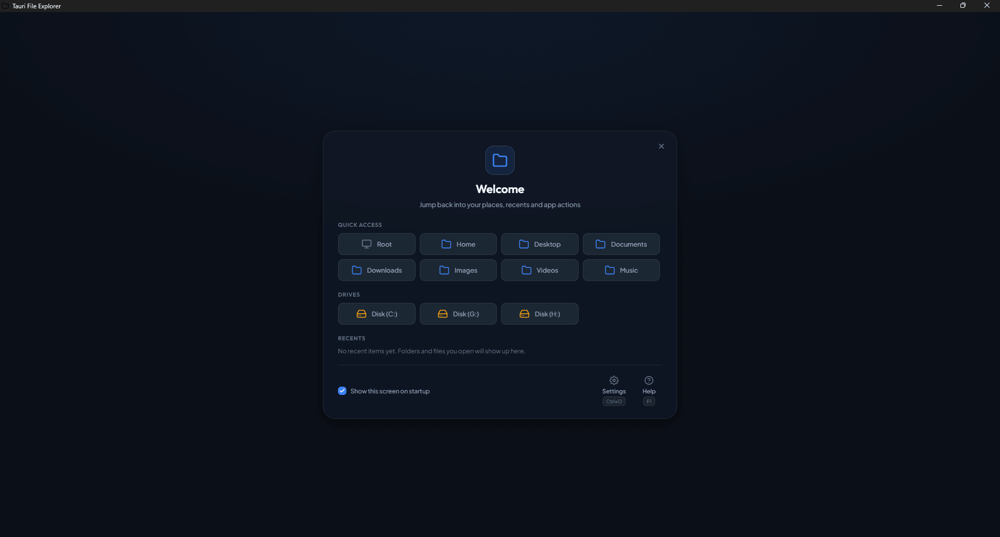
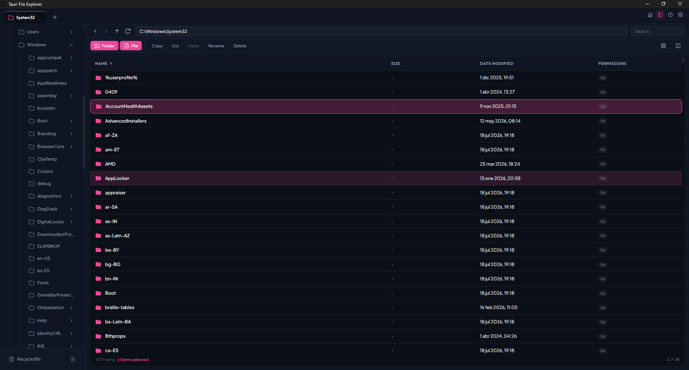
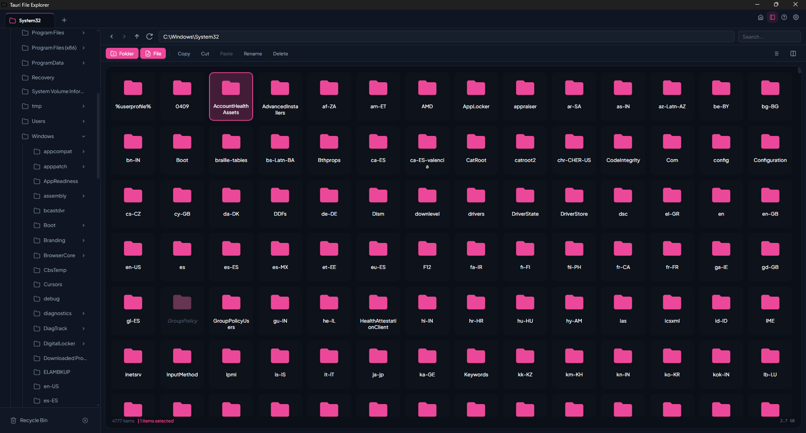
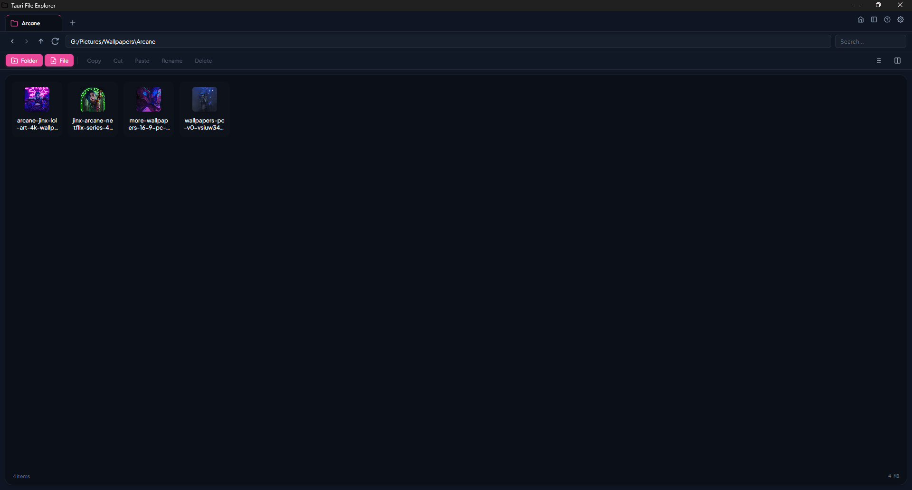
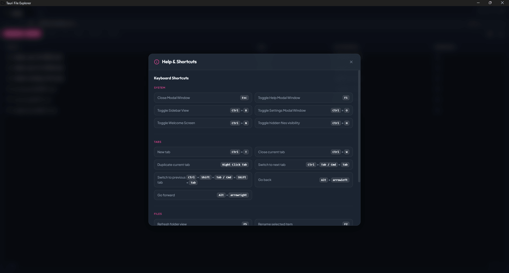
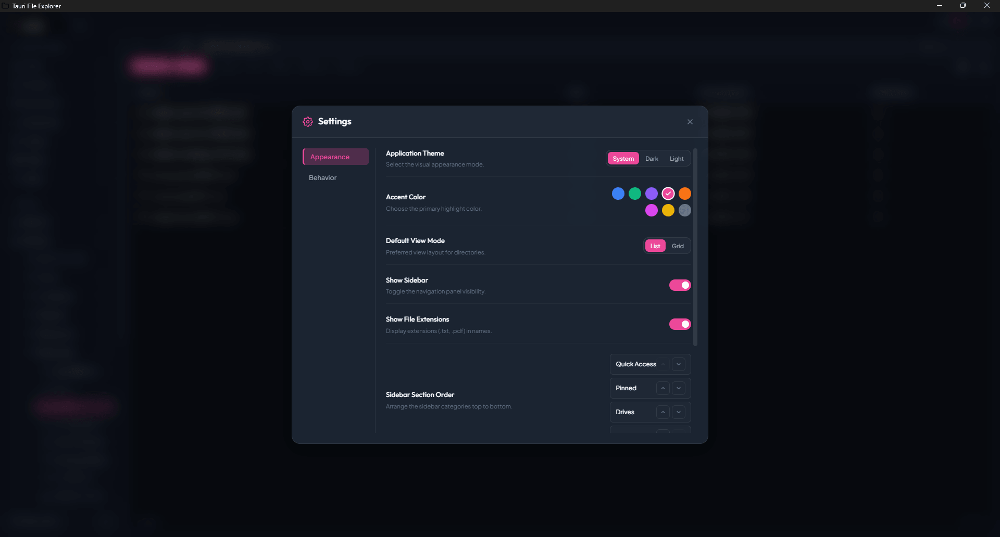
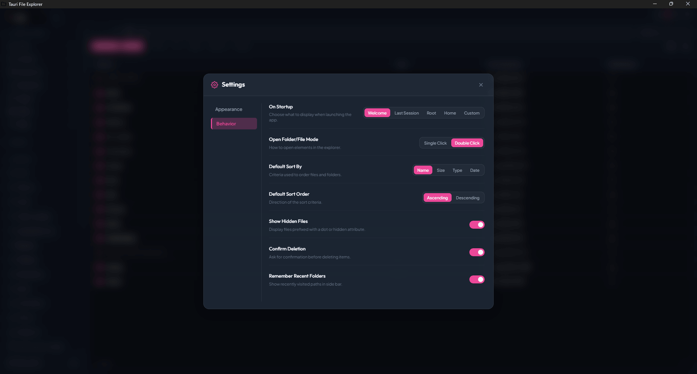

# Tauri File Explorer

A high-performance, cross-platform native file explorer for **Windows**, **macOS**, and **Linux**, built with [Tauri v2](https://tauri.app/) and [Svelte 5](https://svelte.dev/).

It pairs a Rust backend (fast, async filesystem operations, background indexing) with a polished, glassmorphic SvelteKit frontend (multi-tab navigation, split-pane views, reactive state via Svelte 5 runes).

## Features

- **Multi-tab browsing** with full back/forward history per tab
- **Split-pane views** for side-by-side directory operations
- **Indexed recursive search** with background indexing
- **Stale-while-revalidate caching** for instant back/forward navigation
- **Session restoration** — reopen exactly where you left off
- **Quick Access sidebar** with Quick Access folders, drives, and recents
- **Recycle Bin integration** — open and empty the native bin/trash
- **System clipboard** — copy / cut / paste files and folders across panes
- **Polished UI** — dark/light theme, 8 accent colors, glassmorphic modals
- **Native context menus** and keyboard shortcuts for every action
- **Configurable**: startup path, view mode, sort, hidden files, extensions, single/double click, confirmations, accent color

## Screenshots

### Welcome screen


### Explorer list view


### Explorer grid view


### Image preview


### Help and shortcuts


### Settings — Appearance


### Settings — Behavior


## Keyboard shortcuts

| Shortcut | Action |
| --- | --- |
| `Ctrl/Cmd + T` | New tab |
| `Ctrl/Cmd + W` | Close current tab |
| `Ctrl/Cmd + Tab` | Switch to next tab |
| `Ctrl/Cmd + Shift + Tab` | Switch to previous tab |
| `Alt + ←` / `Alt + →` | Go back / forward |
| `F1` | Toggle help |
| `F2` | Rename selected item |
| `F5` | Refresh |
| `Del` | Delete selected items |
| `Ctrl/Cmd + C / X / V` | Copy / Cut / Paste |
| `Ctrl/Cmd + B` | Toggle sidebar |
| `Ctrl/Cmd + H` | Toggle hidden files |
| `Ctrl/Cmd + O` | Toggle settings |
| `Esc` | Close modals / deselect |

## Tech stack

- **Frontend**: SvelteKit 2, Svelte 5 (runes), TypeScript strict, vanilla CSS
- **Backend**: Tauri v2, Rust (tokio, async-std traits via tokio::fs)
- **Plugins**: `@tauri-apps/plugin-opener`, `@tauri-apps/plugin-store`
- **Package manager**: Bun
- **Build tooling**: Vite, svelte-check, cargo

## Project layout

```
src/
  app.css                     Global theme variables (dark/light, accent palette)
  app.html                    Shell document
  routes/
    +layout.svelte            App shell + global context menu
    (explorerView)/
      +layout.svelte          Keyboard shortcut service
      +page.svelte            Tabs + split panes
  lib/
    api/                      (types live next to consumers)
    components/               Svelte components (ExplorerView, Sidebar, ...)
    services/                 Rune-based services (keybinding, dialog, config, recents)
    state/                    Global state (explorer, sidebar)
    types/                    Shared TypeScript types
    utils/                    Pure helpers (formater, path.helper)
src-tauri/
  src/
    lib.rs                    Plugin registration + invoke_handler
    explorer_commands.rs      Filesystem commands (list, copy, move, search, ...)
    main.rs                   Entry point (windows subsystem hint)
  tauri.conf.json             Tauri config
  capabilities/default.json   Tauri permission set
```

## Development

### Prerequisites

- **Node.js 20+** and **Bun** (`npm i -g bun`)
- **Rust** stable + **cargo** (https://rustup.rs)
- Platform-specific Tauri deps: see https://v2.tauri.app/start/prerequisites/

### Install

```bash
bun install
```

### Run in development

```bash
bun run tauri:dev
```

This launches Vite on `http://localhost:1420` and opens the Tauri window pointing at it. The Rust backend recompiles automatically when `src-tauri/src/**` changes.

### Type-check / lint

```bash
bun run check         # full svelte-check
bun run check:watch   # watch mode
bun run typecheck     # errors only
```

Rust lint:

```bash
cargo clippy --manifest-path src-tauri/Cargo.toml -- -D warnings
cargo fmt --check --manifest-path src-tauri/Cargo.toml
```

### Build a production binary

```bash
bun run tauri:build
```

The bundler produces platform-native installers in `src-tauri/target/release/bundle/`:

- **Windows**: `.zip` (portable — extract and run, no installation)
- **macOS**: `.dmg` and `.app`
- **Linux**: `.deb`, `.rpm`, `.AppImage`

## Running on Windows

Download the portable `.zip` from the [latest release](https://github.com/Nyasper/Tauri-File-Explorer/releases/latest), extract it anywhere, and double-click `Tauri File Explorer.exe`.

**Requirements:** Windows 10 (1803+) or Windows 11. The WebView2 Runtime is preinstalled on these systems; no additional setup is needed.

## Configuration

User settings are persisted via the Tauri `store` plugin at:

- **Windows**: `%APPDATA%\com.herre.tauri-svelte-file-explorer\`
- **macOS**: `~/Library/Application Support/com.herre.tauri-svelte-file-explorer/`
- **Linux**: `~/.local/share/com.herre.tauri-svelte-file-explorer/`

The session (open tabs, history, view state) is stored separately at `session.json` in the same location.

## License

[MIT](./LICENSE)
